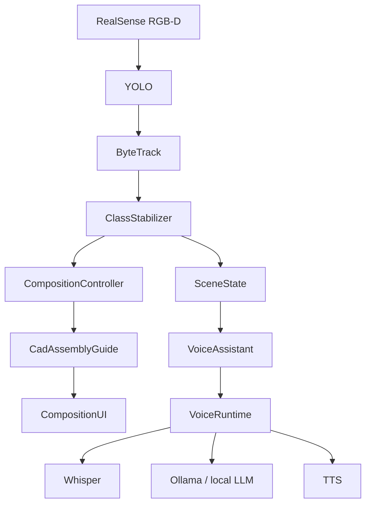
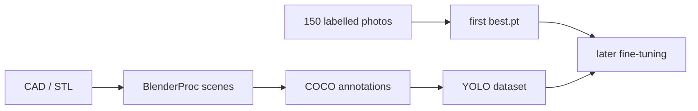
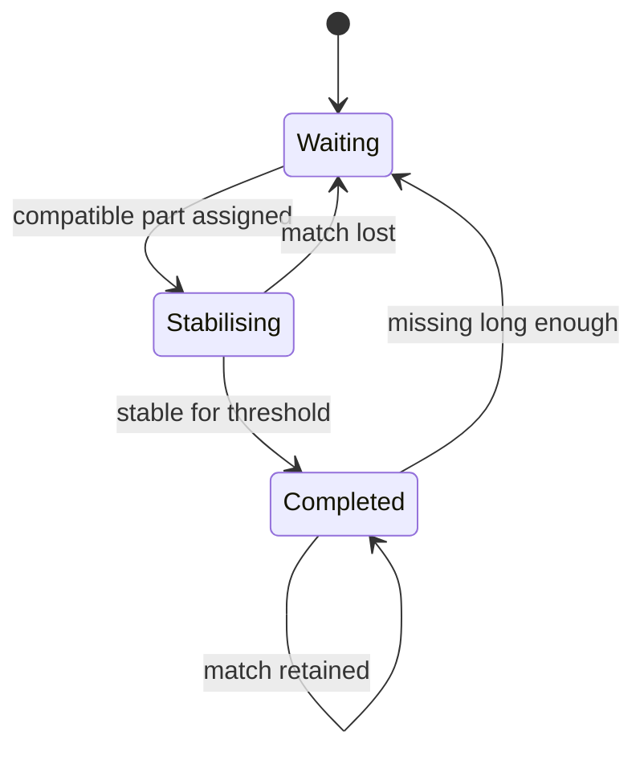
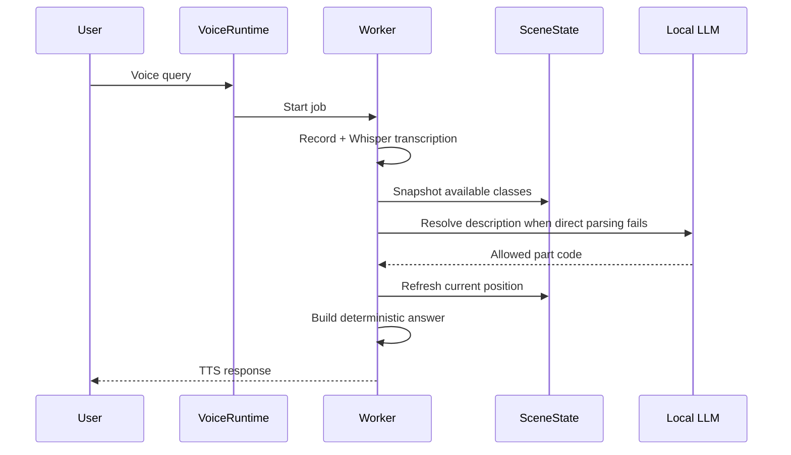

# UML and code walkthrough

This document follows the software in the same order in which data moves through the system. The interactive HTML report contains the full linked source reader; this page is the compact technical map.

## System view

I keep detection, temporal identity, task logic, geometry, presentation and language processing separate. This makes it possible to stop the voice process without stopping video, and to change assembly rules without rewriting the tracker.

## 1. Class map and CAD preparation

`create_class_map.py` reads the class order stored in the detector checkpoint and associates it with STL files and catalogue colours. The output is `class_map.json`. Keeping the checkpoint order is important because class indices are part of the trained model.

`generate_silhouettes.py` converts each STL into a metric top-view PNG. PCA is used to place the thinnest mesh direction on the vertical axis, then the projected triangles are merged and rasterised. The metadata stores millimetres per pixel and physical size.

`orient_and_generate.py` is the manual fallback when automatic orientation is not visually correct. `rotate_silhouette.py` handles in-plane corrections without repeating the complete STL projection.

## 2. Training path

The first detector was trained on **150 photographs manually labelled in Roboflow**. Synthetic data came later.

`generate_meccano_dataset.py` creates BlenderProc scenes with the real camera geometry, varying part placement, density, lighting, materials, backgrounds and optional hand occlusion. It writes COCO annotations directly from the simulated scene.

`prepare_training.py` converts those annotations to YOLO format, splits original images and applies augmentation to training images only. The training command itself is separate from these preparation utilities.

## 3. Runtime initialisation

`meccano_tracker.py` is the runtime entry point. It resolves the model, silhouette and tracker paths, starts RealSense, reads the colour-camera intrinsics and depth scale, loads YOLO and constructs the stabiliser, guide, controller and UI.

The RealSense depth stream is aligned to the colour image. Spatial, temporal and hole-filling filters reduce depth noise before coordinates are used by the rest of the pipeline.

## 4. Detection, tracking and stable class

Each frame is sent to `model.track(..., persist=True)`. ByteTrack provides the temporal ID, while YOLO still provides the current class prediction. These are deliberately treated as two different pieces of information.

`ClassStabilizer` keeps a history for each track ID. The temporary class is chosen by confidence-weighted voting. After enough observations, a dominant class is locked. Once locked, later frame-level class fluctuations do not change the displayed class.

If a track disappears briefly, ghost recovery stores its last position and locked class. A new ID appearing nearby can inherit that lock. This reduces visible class resets caused by short ID losses.

Oversized, tiny or implausibly shaped boxes are rejected before they are allowed to affect the stabilised application state. A second deduplication step removes strongly overlapping duplicate boxes.

## 5. Depth, position and orientation

For locked parts, `depth_at_bbox_center` uses the median of valid depth samples around the box centre. Valid depth and RealSense intrinsics are used to deproject the image point into camera coordinates.

`part_orientation.py` estimates the dominant in-plane direction from the crop and smooths it with a double-angle mean. The double-angle representation is necessary because a 2D orientation has a 180-degree period.

The resulting record contains class, track ID, pixel centre, bounding box, depth, optional 3D coordinates and optional angle. This record is used by both the assembly branch and the voice branch.

## 6. Right-area check and composition controller

`CompositionController` owns the task state. It receives the current left-side parts, right-side parts and workspace observations.

The **right-hand area check remains enabled**. Starting or changing a composition requires stable confirmation that the construction region is clear. This check is independent of target completion: a part can occupy the right area without matching any silhouette.

G starts a composition only when no composition is already active and the prerequisites are satisfied. N requests a new layout under the same workspace conditions. V changes the visibility of the part summary. X clears the composition but leaves tracking running.

If parts remain on the right after completion or X, the interface and voice use the warning **RETURN THE PARTS TO THE STARTING AREA**.

## 7. CAD layout and placement matching

`CadAssemblyGuide` creates one target slot for every recognised part occurrence, including repeated codes. It validates that all required silhouette assets are available before accepting a generated layout.

The native CAD silhouette is scaled to screen pixels with the camera focal length and the measured work-surface depth. Layout generation keeps targets inside the assembly area and rejects overlaps.

Placement matching is one-to-one: one observed part cannot complete two slots. The matching checks class, screen-space position and, when meaningful, orientation. Completion is temporal rather than instantaneous; a match must remain stable for multiple observations.

## 8. Interface

`CompositionUI` draws the control bar, the camera area, the composition panel and the footer. The runtime source uses English labels:

- **G — Start composition**
- **V — Check parts**
- **N — Change composition**
- **R — Voice query**
- **S — Stop voice**
- **X — Finish / reset**

Yellow boxes on the left identify parts that are still needed. Regular tracking boxes remain visible. Right-area diagnostics are visually distinct from placement feedback.

## 9. Voice pipeline

`SceneState` is the thread-safe snapshot of locked parts. `VoiceAssistant` interprets a request, while `VoiceRuntime` supervises the separate worker process.

Directly spoken codes are parsed without the LLM when possible. The local LLM is only a fallback for mapping a qualitative description to an allowed code. Python, not the LLM, selects observed instances and formats numeric position information.

S cancels the current voice task. The worker is asked to stop cooperatively and can be terminated if necessary. The camera and tracking loop continue throughout.

## 10. Shutdown

The runtime closes the voice process, stops the RealSense pipeline and destroys OpenCV windows in the final cleanup path. Tracking state is not reset merely because a composition is cleared.

## Main modules

| Module | Responsibility |
|---|---|
| `meccano_tracker.py` | RGB-D loop, YOLO/ByteTrack integration and orchestration |
| `composition_controller.py` | Task state, prerequisites, reports and return warning |
| `assembly_guide_cad.py` | CAD target generation, layout and one-to-one placement matching |
| `composition_ui.py` | OpenCV interface and visual feedback |
| `part_orientation.py` | In-plane angle estimate and temporal smoothing |
| `voice_assistant.py` | Scene state, request interpretation and response construction |
| `voice_runtime.py` | Voice-process supervision, cancellation and IPC |
| `parts_catalog.py` | English part descriptions, synonyms and attributes |
| `create_class_map.py` | Checkpoint/STL/catalogue mapping |
| `generate_silhouettes.py` | STL-to-silhouette preparation |
| `orient_and_generate.py` | Interactive 3D orientation correction |
| `rotate_silhouette.py` | In-plane PNG correction |
| `generate_meccano_dataset.py` | Synthetic BlenderProc data generation |
| `prepare_training.py` | COCO-to-YOLO conversion and augmentation |
| `preview_colors.py` | Material/lighting preview |

For line-by-line browsing, open the **UML and Code** section in `report/index.html`.
