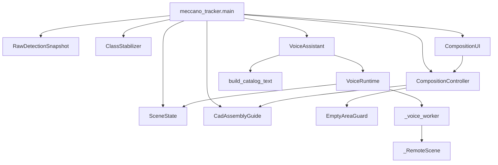
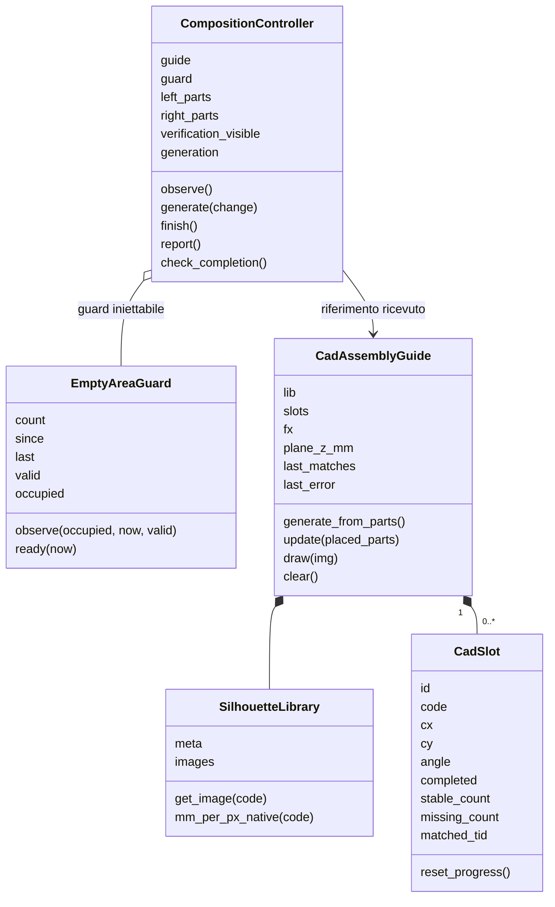
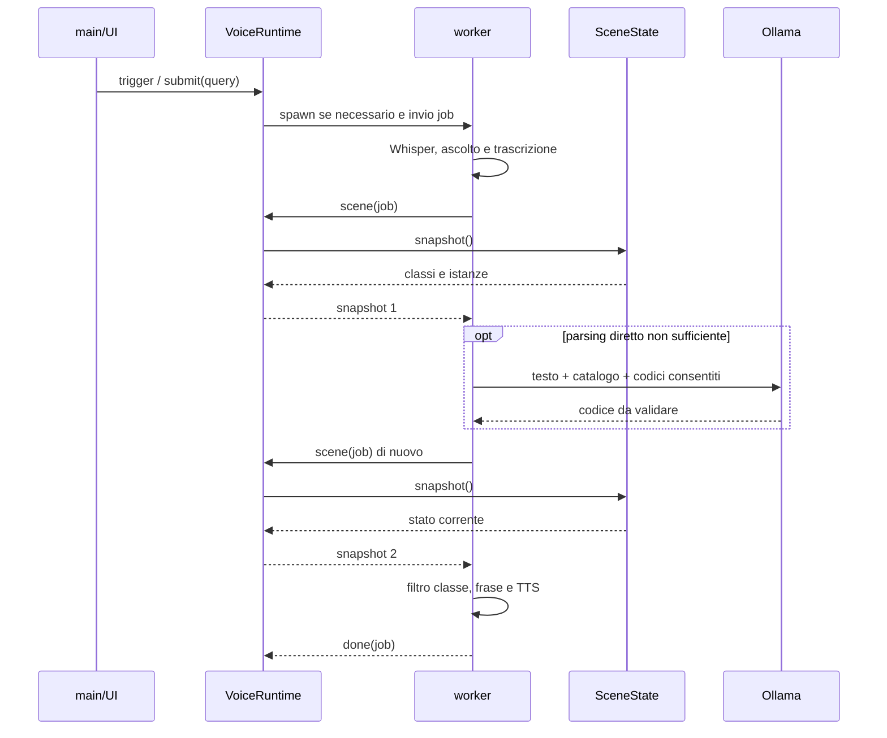

# UML e codice — lettura guidata

In questa guida seguo i dati attraverso il programma e collego ogni passaggio ai nomi di classi, funzioni e metodi. Ho separato la preparazione offline, il ciclo video e il processo vocale: hanno responsabilità e tempi di esecuzione differenti.

## Punto di partenza: il primo modello

Il primo `best.pt` è stato ottenuto con un addestramento su **150 fotografie che ho etichettato manualmente su Roboflow**. Da quel modello sono partito per il riconoscimento RGB-D e l’integrazione del tracking. Solo in seguito ho preparato il dataset sintetico dai CAD e proseguito l’addestramento dai pesi esistenti.

La fase manuale iniziale non viene eseguita dagli script BlenderProc o dal preparatore COCO–YOLO descritti sotto. Non attribuisco alle 150 fotografie lo split o le metriche del fine-tuning successivo. [Storia dell’addestramento](ADDESTRAMENTO.md).

## Versione dei sorgenti

Uso come riferimento il runtime **`meccano_fix_piano_destro`**, con il controllo del piano destro attivo. La raccolta dati sperimentale non fa parte di questa versione.

L’appendice HTML comprende 15 file, 217 schede di classi, funzioni e metodi, 33 blocchi a livello modulo, 5.713 righe consultabili e nove diagrammi collegati alle implementazioni. I numeri di riga di questa guida si riferiscono alle copie identificate nell’appendice, non a file presupposti nel ramo `main`. Mantengo separate la documentazione e la copia operativa del banco.

## Ordine di lettura

**Scopo → dati in ingresso → diagramma → chiamate → istruzioni → dati in uscita → errori.**

Nell’appendice interattiva ho organizzato la lettura in cinque viste:

| Vista | Contenuto |
|---|---|
| Percorso sequenziale | Dodici tappe dalla mappa dei codici alla chiusura del programma. |
| UML cliccabile | Componenti, classi, sequenze e stati collegati ai simboli. |
| File e funzioni | Contratto del modulo, metodi, funzioni locali e blocchi eseguiti all’import. |
| Sorgente integrale | Righe numerate, intervalli evidenziati e collegamenti alla spiegazione. |
| Tracciabilità | Versione, origine e SHA-256 delle copie consultabili. |

La lettura delle istruzioni esplicita rami `if/else`, cicli, gestione delle eccezioni, assegnazioni e ritorni. È una lettura statica: il browser non esegue Python, camera o microfono.

## 1. Mappa delle responsabilità



Ho concentrato il coordinamento in `main`, le regole del compito in `CompositionController`, la generazione e la verifica degli slot in `CadAssemblyGuide`, e la presentazione in `CompositionUI`. `VoiceRuntime` gestisce il processo separato; `VoiceAssistant` contiene parsing e costruzione della risposta. Le frecce indicano dipendenze e invocazioni, non un ordine temporale completo.

## 2. Classi della composizione



Ogni `CadSlot` rappresenta un’occorrenza richiesta: tre dadi dello stesso codice sono tre slot. Distinguo quindi l’ID del tracker, che identifica un’associazione temporale, dall’ID dello slot, che identifica un bersaglio nella composizione.

## 3. Percorso sequenziale

### Tappa 01 — Tassonomia e corrispondenze

`crea_mappa.leggi_nomi` legge i nomi ordinati del checkpoint; `abbina` associa il nome o il prefisso dello STL al codice; `leggi_colori` ricava la palette dal catalogo. `main` scrive `mappa_classi.json`.

A090 e A823 sono refusi di etichettatura, non pezzi fisici. A132 è il codice corretto; A622 e A632 sono distinti. Conservare gli indici di un checkpoint non equivale a considerare validi i refusi. Nel codice di riferimento `NON_PART_CLASSES` non contiene ancora un’esclusione esplicita di A090/A823: tengo visibile questo limite senza presentarlo come già corretto.

### Tappa 02 — Preparazione delle sagome

`generate_silhouettes.main` carica gli STL; `auto_flatten` orienta la mesh con PCA sui vertici; `mesh_outline_polygon` unisce la proiezione dei triangoli su XY; `rasterize_polygon` applica la scala pixel/mm e il ribaltamento verticale; `mask_to_rgba` inserisce la maschera nel canale alpha. Il risultato è costituito da PNG e metadati.

La funzione interna `fill_holes` elimina i fori della proiezione. Uso quindi la sagoma come bersaglio visivo, non come misura del numero di fori. `orient_and_generate` permette una correzione 3D interattiva; `rotate_silhouette` corregge la PNG nel piano.

### Tappa 03 — Sintetico e preparazione YOLO

`genera_dataset_meccano.py` esegue anche codice a livello modulo: lettura degli argomenti, inizializzazione, camera, asset e ciclo delle scene. Ogni scena varia ambiente, densità e selezione dei pezzi, applica materiali e fisica, posiziona l’eventuale mano, aggiunge le viste, renderizza e scrive COCO. `pulisci_coco` salva un file filtrato distinto dal grezzo.

`prepara_addestramento.py` legge `classi.json`, filtra le annotazioni, divide le immagini originali, copia gli split e aumenta solo il train. `scrivi_yolo` converte i box COCO in centro e dimensioni normalizzate. Lo script scrive `data.yaml`, **non esegue l’addestramento**.

Il calcolo usa `target` come totale train+val, mentre l’help lo descrive come totale del train. Inoltre lo split del preparatore è per immagine e non raggruppa le viste della stessa scena. Distinguo questo comportamento dallo split per scena del generatore.

### Tappa 04 — Avvio del runtime

In `meccano_tracker.py`, L580–809, `main` controlla percorsi e dipendenze, carica YOLO e registra `RawDetectionSnapshot` prima della prima chiamata a `model.track`. Crea stabilizzatore e filtro angolare, avvia RealSense, legge intrinseci e depth scale, poi costruisce guida, controller e UI. La voce è opzionale.

Il guard `__main__` chiama `freeze_support` e `main`: l’import da un processo figlio non deve aprire una seconda RealSense.

### Tappa 05 — Detection, ID e classe stabile

Il ciclo allinea la depth al colore e applica i filtri. `model.track(persist=True, ...)` produce i track; il callback conserva i rilevamenti prima dell’assegnazione e del filtraggio degli ID.

Nel main, `box_plausibile` interviene **dopo `model.track` e prima dello stabilizzatore**. Alcuni commenti precedenti lo descrivono come filtro anteriore al tracker: nella lettura seguo l’ordine effettivo delle chiamate.

`ClassStabilizer.update`, L145–182, aggiorna il centro, prova l’eredità del lock per un nuovo ID e restituisce subito un lock rigido già esistente. Le osservazioni con confidenza sufficiente entrano nel buffer. `_weighted_majority` somma le confidenze per la classe provvisoria; il blocco usa invece `Counter` e dominanza per numero di osservazioni.

```python
# Criterio del lock; distinto dal voto pesato della classe provvisoria.
if len(buf) >= self.lock_after and tid not in self.locked:
    counts = Counter(c for c, _ in buf)
    top_cls, top_count = counts.most_common(1)[0]
    if top_count / len(buf) >= self.dominance:
        self.locked[tid] = top_cls
```

`cleanup` conserva e scarta i ghost. `_try_inherit_from_ghost` trasferisce il lock a un nuovo ID vicino: non garantisce di mantenere lo stesso identificativo. La deduplicazione preferisce lock, ID basso e confidenza alta.

### Tappa 06 — Geometria osservata e scena

Per ogni lock, `depth_at_bbox_center` usa la mediana di una finestra 9×9, escludendo gli zeri. In assenza di misura valida il record mantiene coordinate mancanti, non valori precedenti.

`estimate_angle_deg` restituisce angolo e aspect ratio, non una maschera come indicato da una docstring residua. Il main ammette nel filtro angolare solo osservazioni abbastanza allungate. `AngleSmoother.get` media i vettori a doppio angolo per rispettare il periodo di 180°.

`SceneState.update_part` registra i dati; `sync_with_active` elimina le istanze non più presenti tra i lock sopravvissuti alla deduplicazione. Le liste sinistra/destra sono separate in base al centro del pezzo.

### Tappa 07 — Controllo del piano e prerequisiti

`workspace_observations`, L395–492 del tracker, prepara le osservazioni del piano: track plausibili anche a bassa confidenza e candidati raw con confidenza almeno 0,35. `None` significa controllo indisponibile; `[]` significa osservazione disponibile senza detection.

`CompositionController.observe`, L131–192, usa l’intersezione di area positiva del bbox con la destra, aggiorna `EmptyAreaGuard` e controlla la firma dell’inventario. La scritta dell’etichetta non fa parte del bbox. Toccare soltanto la linea non occupa il piano destro.

`EmptyAreaGuard.ready`, L82–85, richiede frame validi e recenti, almeno otto osservazioni libere e almeno 0,8 secondi. L’inventario richiede sei frame stabili. `generate`, L260–286, distingue G da N: G non sostituisce una composizione attiva. Un comando rifiutato non viene eseguito automaticamente appena il piano torna libero.

### Tappa 08 — Generazione transazionale

`CadAssemblyGuide.generate_from_parts`, L519–581, valida asset e profondità. Conserva lo stato precedente, prova fino a 22 proposte e forza il layout parallelo dopo i primi quattro tentativi. Verifica quantità e codici con `Counter`, contenimento e sovrapposizioni.

`_build_figure` distingue strutture e fissaggi, crea le ancore, converte millimetri in pixel, avvicina e separa le maschere. `_scaled_rotated_silhouette` applica `mm_per_px_native * fx / plane_z_mm`, poi ruota su un canvas espanso. Il cambio richiede una firma diversa; il jitter è una traslazione, non una riduzione della scala.

Se nessuna proposta passa i controlli, ripristino lo stato precedente. Un errore non deve lasciare una figura con meno pezzi del previsto.

### Tappa 09 — Piazzamenti e pulsante V

`_match_distance`, L906–929, filtra classe, centro nella destra e distanza entro `POS_TOL_PX=90`. Nel controllo di posizione corrente non usa `X_mm/Y_mm`. Verifica l’angolo quando è disponibile e il pezzo non è esente: `angle_deg=None` non determina da solo un rifiuto.

`_assign_parts`, L931–975, deduplica gli ID e costruisce un matching bipartito con riassegnazioni. Un pezzo non può completare due slot. L’algoritmo massimizza il numero di abbinamenti; l’ordinamento per distanza non garantisce il minimo globale della loro somma.

`update`, L876–904, accumula match fino a 12 osservazioni per completare e assenze fino a 12 per revocare. `report` distingue richiesti, completati, già a destra ma da sistemare e copie da prendere a sinistra. V alterna i richiami, non spegne la verifica geometrica continua.

### Tappa 10 — Domanda vocale

`trigger` invia la richiesta a `VoiceRuntime.submit`; `_voice_worker` crea o riusa i modelli locali. `_run_pipeline`, L297–356, carica Whisper al bisogno, ascolta, trascrive e richiede un primo snapshot per le classi disponibili.

`_extract_class` prova regole dirette per codici e numeri; solo dopo usa Llama e il catalogo. `_extract_class_llama` accetta soltanto un codice della lista consentita. Un codice consentito può comunque essere semanticamente sbagliato. L’LLM non riceve immagini.

Dopo il parsing, la pipeline richiede un secondo snapshot, filtra la classe in Python e costruisce la frase. Senza depth segnala l’assenza della misura e usa una posizione relativa. La risposta numerica è deterministica rispetto ai record, non una garanzia di correttezza della percezione.



### Tappa 11 — Stop e risultati tardivi

`stop_voice` cancella l’annuncio di rientro pendente e inoltra Stop. `VoiceRuntime._request_stop_locked`, L74–84, invalida `current` prima di impostare l’Event. `_tick_locked`, L139–178, scarta i messaggi che non appartengono al job corrente.

Se il worker non termina cooperativamente, il supervisore usa `terminate` e poi `kill`, limitandosi al processo figlio locale. Non termina il server Ollama esterno. Il processo della camera e gli ID non vengono azzerati.

Gli annunci di rientro hanno il tag `return_parts`: la cancellazione del tag non deve interrompere una domanda indipendente.

### Tappa 12 — X, rendering e chiusura

`finish` chiama `guide.clear` e attiva il controllo di rientro; non cancella tracker o SceneState. `check_completion` lo attiva anche al primo completamento della figura. `_update_return_warning` mantiene il banner fino alla conferma stabile di piano libero.

L’avviso è **RIPORTARE I PEZZI NEL PIANO DI PARTENZA**. Stop interrompe la voce, non il banner.

`draw_tracked_scene` disegna sagome, richiami sinistri, diagnostica dei blocchi destri e infine i riquadri tracciati. La UI ridimensiona uniformemente la camera e dispone controlli, pannello e footer fuori dall’immagine. Nel `finally`, il programma chiude voce, pipeline avviata e finestre.

## 4. Inventario dei file

| File | Responsabilità | Confine |
|---|---|---|
| meccano_tracker.py | Avvio, ciclo RGB-D, tracking, scena, azioni | Distinto dalla preparazione offline. |
| composition_controller.py | Inventario, prerequisiti, comandi, report e avviso | Non importa camera, YOLO o audio. |
| assembly_guide_cad.py | Sagome, layout, matching e avanzamento | Bersaglio visivo, non piano di attuazione robotica. |
| part_orientation.py | Angolo da contorno e media temporale | Direzione 2D modulo 180°, non posa 6D. |
| composition_ui.py | Finestra, pulsanti, pannello e richiami | Presenta lo stato senza scavalcare il controller. |
| voice_assistant.py | SceneState, STT, parsing, risposta e TTS | LLM sul testo; coordinate dai record. |
| voice_runtime.py | Job, IPC, priorità, stop e processo figlio | Non ferma camera o Ollama esterno. |
| parts_catalog.py | Descrizioni, sinonimi, colori e fori | Alcune descrizioni richiedono completamento. |
| generate_silhouettes.py | PCA, proiezione, PNG e metadati | Preparazione una tantum. |
| orient_and_generate.py | Correzione interattiva 3D | PNG scritta prima della conferma dei metadati. |
| rotate_silhouette.py | Rotazione 2D delle PNG | size_mm scambiato solo per 90°/270°. |
| crea_mappa.py | Collegamento indice, STL e colore | Non migra le annotazioni esistenti. |
| genera_dataset_meccano.py | Scene BlenderProc e COCO | Contiene anche parametri inutilizzati. |
| prepara_addestramento.py | Split, conversione e augmentation | Non esegue YOLO.train. |
| prova_colori.py | Render di sfere per tarare il materiale | RGB stampati in console, non sull’immagine. |

## 5. Copertura e limiti

Ho incluso nella lettura anche funzioni locali, metodi di utilità e blocchi a livello modulo. Gli strumenti storici `session_logger.py`, `analyze.py` e le rinomine una tantum non sono reinseriti nel runtime corrente.

Il pacchetto di riferimento contiene 124 funzioni test in sei file. È un inventario dei test, non il risultato di una nuova esecuzione. Le verifiche dell’HTML riguardano navigazione, collegamenti, diagrammi e immagini; non sostituiscono una prova con RealSense, pesi, silhouette e audio reali.

Per le librerie esterne descrivo il confine delle chiamate utilizzate. La documentazione non comprende i loro sorgenti interni né tutti gli esportatori originali dei grafici. Senza gli output numerici non ricostruisco nuove metriche dalle immagini.

[Pagina principale](../README.md) · [Addestramento](ADDESTRAMENTO.md) · [Scelte progettuali](DECISIONS.md)
