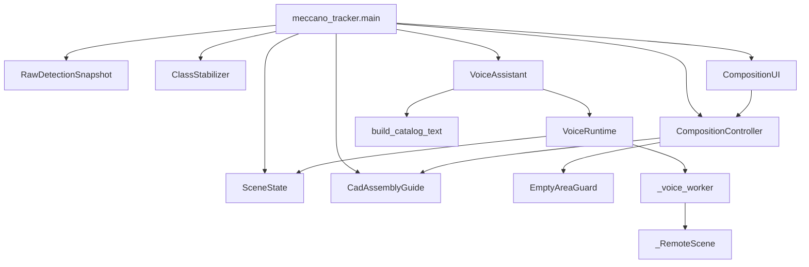
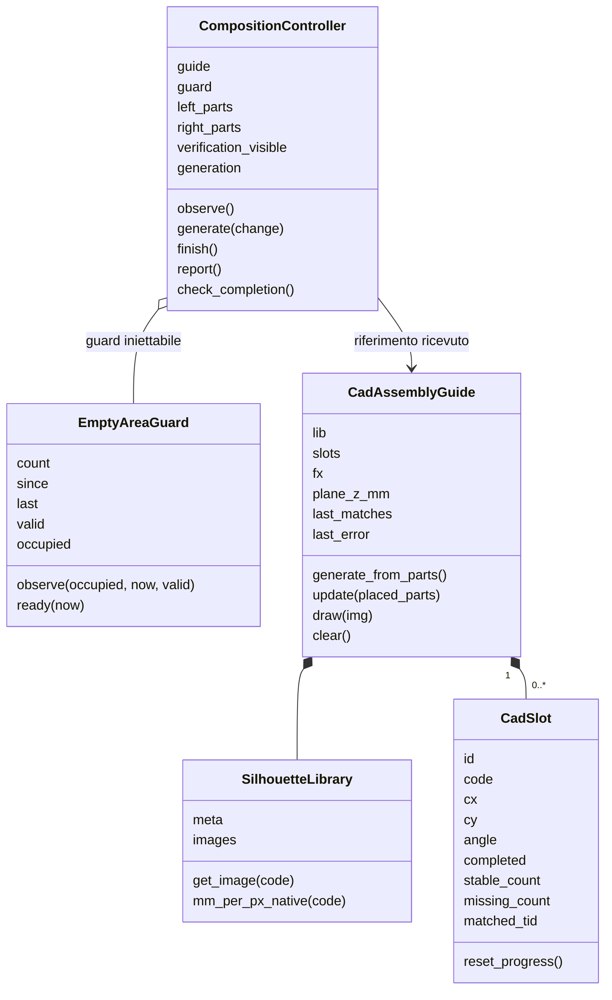
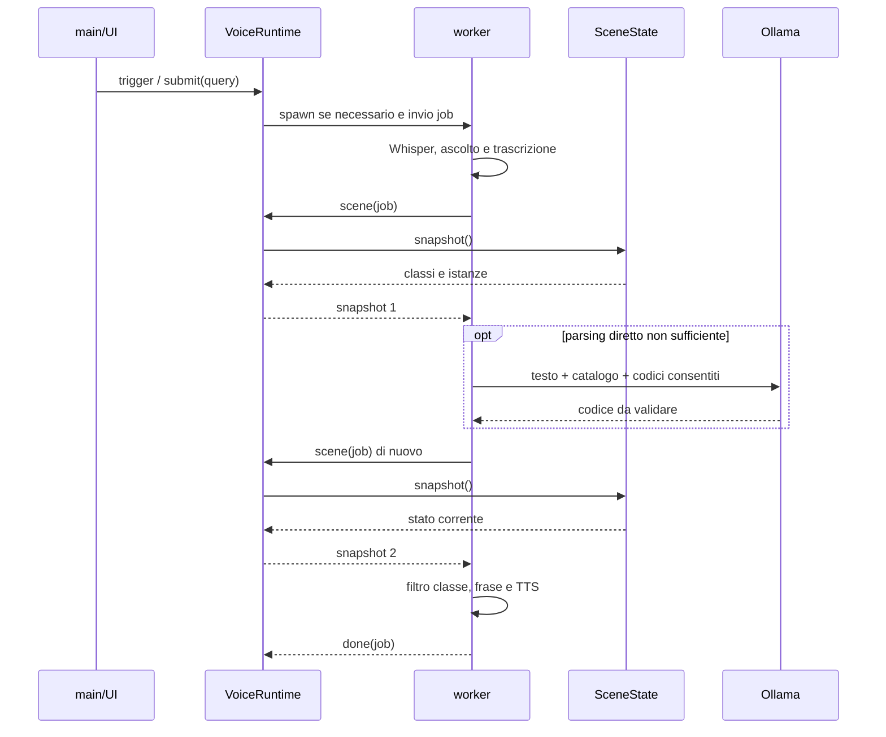

# UML e codice — lettura guidata

Questa guida collega la logica della pipeline ai nomi reali di classi, funzioni e metodi. Distingue la preparazione offline dal programma live e dal processo vocale.

## Versione di riferimento e stato della consegna

La baseline del runtime è **`meccano_fix_piano_destro.zip`**, fornita nella conversazione di sviluppo: **il controllo del piano destro resta attivo**. La variante in cui G rigenera incondizionatamente non è il riferimento di questa guida.

L'appendice interattiva consegnata nella conversazione come **`Meccano_Relazione_UML_Codice.html`** comprende 15 file, 217 schede di simboli, 33 blocchi eseguiti a livello modulo, 5.713 righe consultabili e nove diagrammi collegati alle implementazioni. Il file HTML comprende anche la relazione e le immagini precedentemente fornite. **Questo commit aggiunge la guida Markdown alla repository; non pubblica quel file HTML completo e non attesta un deployment GitHub Pages.**

I numeri di riga riportati qui si riferiscono ai file della baseline, non a sorgenti implicitamente presenti su `main`. Gli strumenti offline provengono dagli allegati originali. Non si riscrivono i sorgenti per farli coincidere con i commenti.

## Come leggere il codice

La sequenza consigliata è: **scopo → dati in ingresso → diagramma → chiamate → istruzioni → dati in uscita → condizioni di errore**.

Nell'HTML, la voce **UML e codice · lettura guidata** apre cinque viste:

- **Percorso sequenziale:** dodici tappe dal catalogo alla chiusura del programma.
- **UML cliccabile:** componenti, classi, sequenze e stati; i nodi aprono i simboli reali.
- **File e funzioni:** contratto del modulo, spiegazione specifica di ogni simbolo e blocchi esterni alle funzioni.
- **Sorgente integrale:** righe numerate, intervalli evidenziati, ricerca della funzione alla riga corrente, copia e salvataggio della copia di lettura.
- **Tracciabilità:** origine dei file, SHA-256, limiti e mascherature dichiarate dei soli percorsi locali.

La lettura delle istruzioni rende espliciti `if/else`, cicli, `try/except/finally`, assegnazioni, chiamate, ritorni e interruzioni. È un'analisi statica: **non esegue camera, microfono, modello o Python nel browser**.

## 1. Mappa delle responsabilità



Le frecce rappresentano dipendenze e invocazioni, non un ordine temporale completo. `main` orchestra; `CompositionController` applica le regole del compito; `CadAssemblyGuide` costruisce e verifica gli slot; `CompositionUI` presenta lo stato. `VoiceRuntime` gestisce il processo separato, mentre `VoiceAssistant` contiene parsing e costruzione della risposta.

## 2. UML delle classi della composizione



Ogni `CadSlot` è un'occorrenza richiesta. Tre dadi dello stesso codice sono tre slot, non una sola classe da completare. L'ID del tracker e l'ID dello slot hanno significati differenti.

## 3. Percorso sequenziale dei dati

### Tappa 01 — Tassonomia e corrispondenze

`crea_mappa.leggi_nomi` legge i nomi ordinati del checkpoint; `abbina` associa nome o prefisso dello STL al codice; `leggi_colori` ricava la palette dal catalogo. `main` scrive `mappa_classi.json`.

**A090 e A823 sono refusi, non pezzi fisici. A132 è il codice confermato. A622 e A632 sono distinti.** Conservare gli indici di un checkpoint non significa riconoscere i refusi come pezzi validi. La baseline qui descritta non contiene un'esclusione applicativa esplicita di A090/A823 in `NON_PART_CLASSES`: è un limite documentato, non una correzione silenziosamente applicata.

### Tappa 02 — Preparazione delle sagome

`generate_silhouettes.main` carica gli STL; `auto_flatten` orienta la mesh con PCA sui vertici; `mesh_outline_polygon` unisce la proiezione dei triangoli su XY; `rasterize_polygon` applica la scala pixel/mm e il ribaltamento verticale; `mask_to_rgba` mette la maschera in alpha. Sono salvati PNG e metadati.

La funzione interna `fill_holes` elimina deliberatamente i fori della proiezione. La sagoma è usata come bersaglio visivo, non come misurazione del numero di fori. `orient_and_generate` permette una correzione 3D interattiva; `rotate_silhouette` corregge la PNG nel piano.

### Tappa 03 — Sintetico e dataset YOLO

`genera_dataset_meccano.py` esegue anche codice a livello modulo: argomenti, inizializzazione, camera, asset e ciclo scene. Ogni scena varia ambiente, densità e selezione; applica materiali e fisica; posiziona l'eventuale mano; aggiunge viste; renderizza e scrive COCO. `pulisci_coco` scrive un file filtrato distinto dal grezzo.

`prepara_addestramento.py` legge `classi.json`, filtra annotazioni, divide le immagini originali, copia gli split e aumenta solo il train. `scrivi_yolo` converte box COCO in centro e dimensioni normalizzate. Lo script scrive `data.yaml`, **non chiama l'addestramento**.

Il valore `target` è usato dal calcolo come totale train+val, anche se l'help parla del train. Lo split di questo script è per immagine e non raggruppa viste della stessa scena: questo limite va distinto dallo split per scena del generatore.

### Tappa 04 — Avvio del runtime

In `meccano_tracker.py`, L580–809, `main` controlla percorsi e dipendenze. Carica YOLO e registra `RawDetectionSnapshot` **prima della prima chiamata** a `model.track`. Crea stabilizzatore e filtro angolare, avvia RealSense, legge intrinseci/depth scale e costruisce guida, controller e UI. La voce è opzionale.

Il guard `__main__` chiama `freeze_support` e `main`: l'import da un processo figlio non deve aprire una seconda RealSense.

### Tappa 05 — Detection, ID e classe stabile

Il ciclo allinea depth al colore e applica i filtri. `model.track(persist=True, ...)` produce i track; il callback conserva i rilevamenti prima dell'assegnazione/filtraggio degli ID.

**Il filtro `box_plausibile` del main avviene dopo `model.track`**, prima di aggiornare lo stabilizzatore: alcuni commenti storici lo descrivono impropriamente come precedente al tracker.

`ClassStabilizer.update`, L145–182, aggiorna il centro, prova l'eredità del lock per un nuovo ID e restituisce subito un lock rigido già esistente. Le osservazioni con confidenza sufficiente entrano nel buffer. `_weighted_majority` somma le confidenze per la classe provvisoria; il blocco usa invece `Counter` e dominanza per numero di osservazioni.

```python
# Estratto della baseline: criterio del lock, non voto pesato.
if len(buf) >= self.lock_after and tid not in self.locked:
    counts = Counter(c for c, _ in buf)
    top_cls, top_count = counts.most_common(1)[0]
    if top_count / len(buf) >= self.dominance:
        self.locked[tid] = top_cls
```

`cleanup` conserva/scarta ghost. `_try_inherit_from_ghost` usa vicinanza spaziale e trasferisce il lock a un nuovo ID: **non mantiene necessariamente lo stesso ID fisico**. La deduplicazione preferisce lock, ID basso e confidenza alta.

### Tappa 06 — Geometria osservata e stato della scena

Per ogni lock, `depth_at_bbox_center` usa la mediana di un patch 9×9 escludendo gli zeri. Senza misura valida il record conserva coordinate mancanti, non coordinate vecchie.

`estimate_angle_deg` restituisce **angolo e aspect ratio**, non una maschera come afferma una docstring residua. Il main ammette nel filtro angolare solo osservazioni abbastanza allungate. `AngleSmoother.get` media i vettori a doppio angolo per rispettare il periodo di 180°.

`SceneState.update_part` registra i dati; `sync_with_active` elimina le istanze non più presenti tra i lock sopravvissuti alla deduplicazione. Le liste sinistra/destra sono separate in base al centro del pezzo.

### Tappa 07 — Piano destro e prerequisiti

`workspace_observations`, L395–492 del tracker, crea osservazioni dedicate al piano: track plausibili anche a bassa confidenza e candidati raw con confidenza almeno 0.35. `None` significa controllo indisponibile; `[]` osservazione disponibile senza detection.

`CompositionController.observe`, L131–192, costruisce i blocchi usando l'intersezione di area positiva del bbox con la destra, aggiorna `EmptyAreaGuard` e controlla la firma dell'inventario. La scritta dell'etichetta non è parte del bbox. Toccare soltanto la linea non occupa il piano destro.

`EmptyAreaGuard.ready`, L82–85, richiede insieme frame validi/recenti, almeno otto osservazioni libere e almeno 0.8 secondi. L'inventario richiede sei frame stabili. `generate`, L260–286, distingue avvio G da cambio N: G non sostituisce una composizione attiva. Un comando rifiutato non viene ripetuto da solo appena il piano è libero.

### Tappa 08 — Generazione transazionale

`CadAssemblyGuide.generate_from_parts`, L519–581, valida tutti gli asset e la profondità. Conserva lo stato precedente, prova fino a 22 proposte e forza il layout parallelo dopo i primi quattro tentativi. Verifica quantità e codici con `Counter`, contenimento e sovrapposizioni.

`_build_figure` distingue strutture/fissaggi, crea ancore, converte mm in pixel, avvicina e separa le maschere. `_scaled_rotated_silhouette` applica `mm_per_px_native * fx / plane_z_mm`, poi ruota su un canvas espanso. Il cambio richiede una firma diversa; il jitter è una traslazione, non una riduzione della scala.

Se nessuna proposta passa, lo stato precedente viene ripristinato. Un errore non deve produrre una composizione con meno pezzi del previsto.

### Tappa 09 — Piazzamenti e pulsante V

`_match_distance`, L906–929, filtra classe, centro nella destra e distanza entro `POS_TOL_PX=90`. Non usa `X_mm/Y_mm` nel test di posizione corrente. L'angolo è verificato quando disponibile e non esente: **`angle_deg=None` non provoca da solo un rifiuto**.

`_assign_parts`, L931–975, deduplica gli ID e costruisce un matching bipartito con riassegnazioni. Un pezzo non può completare due slot. L'algoritmo massimizza il numero degli abbinamenti; l'ordinamento per distanza non garantisce un minimo globale della somma delle distanze.

`update`, L876–904, accumula match fino a 12 osservazioni per completare e assenze fino a 12 per revocare. `report` distingue richiesti, completati, già a destra ma da sistemare e copie ancora da prendere a sinistra. V alterna i richiami; **non spegne la verifica geometrica continua**.

### Tappa 10 — Domanda vocale

`trigger` invia query a `VoiceRuntime.submit`; `_voice_worker` crea o riusa modelli locali. `_run_pipeline`, L297–356, carica Whisper pigramente, ascolta, trascrive e richiede un primo snapshot per le classi disponibili.

`_extract_class` prova regole dirette per codici/numeri; solo dopo usa Llama e il catalogo. `_extract_class_llama` accetta soltanto un codice della lista consentita. **Un codice consentito può comunque essere semanticamente sbagliato.** L'LLM non riceve immagini.

La pipeline richiede un secondo snapshot dopo il parsing, filtra la classe in Python e costruisce la frase. Senza depth dichiara l'assenza della misura e usa una posizione relativa. La lettura numerica è deterministica rispetto ai record, non una garanzia di verità della percezione.



### Tappa 11 — Stop e risultati tardivi

`stop_voice` cancella l'annuncio di rientro pendente e inoltra Stop. `VoiceRuntime._request_stop_locked`, L74–84, invalida `current` prima di impostare l'Event. `_tick_locked`, L139–178, scarta i messaggi non appartenenti al job corrente.

Se il worker non termina cooperativamente, il supervisore usa `terminate` e poi `kill`, limitandosi al **processo figlio locale**. Non termina il server Ollama esterno. Il processo della camera e gli ID non vengono azzerati.

Gli annunci di rientro sono identificati dal tag `return_parts`. La cancellazione del tag non deve interrompere una domanda indipendente.

### Tappa 12 — X, banner, rendering e uscita

`finish` chiama `guide.clear` e attiva il controllo di rientro; non cancella tracker o SceneState. `check_completion` lo attiva anche al primo completamento della figura. `_update_return_warning` mantiene il banner fino alla conferma stabile di piano libero.

Il testo è **RIPORTARE I PEZZI NEL PIANO DI PARTENZA**. Stop interrompe la voce, non il banner.

`draw_tracked_scene` disegna sagome, richiami sinistri, diagnostica dei blocchi destri e infine i riquadri tracciati. La UI ridimensiona uniformemente la camera e colloca controlli/pannello/footer fuori dall'immagine. Nel `finally`, il programma chiude voce, pipeline avviata e finestre.

## 4. Inventario dei file documentati

| File | Responsabilità | Confine importante |
|---|---|---|
| meccano_tracker.py | Avvio, ciclo RGB-D, tracking, stato, azioni | Non è la pipeline offline |
| composition_controller.py | Inventario, prerequisiti, comandi, report e avviso | Non importa camera, YOLO o audio |
| assembly_guide_cad.py | Sagome, layout, matching e avanzamento | Bersaglio visivo, non piano di attuazione robotica |
| part_orientation.py | Angolo da contorno e media temporale | Direzione 2D modulo 180°, non posa 6D |
| composition_ui.py | Finestra, pulsanti, pannello e richiami | Presenta lo stato, non scavalca il controller |
| voice_assistant.py | SceneState, STT, parsing, risposta e TTS | LLM sul testo; coordinate dai record |
| voice_runtime.py | Job, IPC, priorità, stop e processo figlio | Non ferma camera o Ollama esterno |
| parts_catalog.py | Descrizioni, sinonimi, colori e fori | Contiene residui e placeholder dichiarati |
| generate_silhouettes.py | PCA, proiezione, PNG e metadati | Preparazione una tantum |
| orient_and_generate.py | Correzione interattiva 3D | PNG scritta prima della conferma dei metadati |
| rotate_silhouette.py | Rotazione 2D delle PNG | size_mm scambiato solo per 90°/270° |
| crea_mappa.py | Collegamento indice, STL e colore | Non migra le annotazioni esistenti |
| genera_dataset_meccano.py | Scene BlenderProc e COCO | Parametri presenti ma inutilizzati segnalati |
| prepara_addestramento.py | Split, conversione e augmentation | Non esegue YOLO.train |
| prova_colori.py | Render di sfere per tarare il materiale | Valori RGB stampati in console, non sull'immagine |

## 5. Copertura e limiti

La documentazione indicizza anche funzioni locali, metodi di utilità e blocchi a livello modulo. Gli script storici `session_logger.py`, `analyze.py` e le rinomine una-tantum non vengono reinseriti nel runtime: la raccolta dati sperimentale resta esclusa.

La lettura sintattica del pacchetto di riferimento individua **124 funzioni test in sei file**: è un inventario, non l'esito di una nuova esecuzione. Le verifiche del nuovo HTML riguardano navigazione, rimandi ai simboli/righe, diagrammi, immagini incorporate e visualizzazione; non sostituiscono una prova con RealSense, pesi, silhouette e audio reali.

Le librerie esterne vengono documentate al confine delle chiamate visibili. Non sono presenti negli allegati i loro sorgenti interni, né tutti gli esportatori originali dei grafici e il CSV necessario per rigenerarli. Queste assenze non vengono colmate con codice inventato o nuove metriche ricavate dalle immagini.
